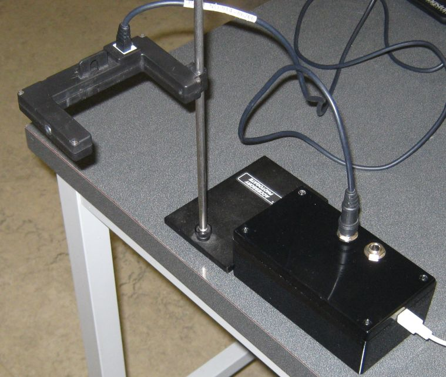
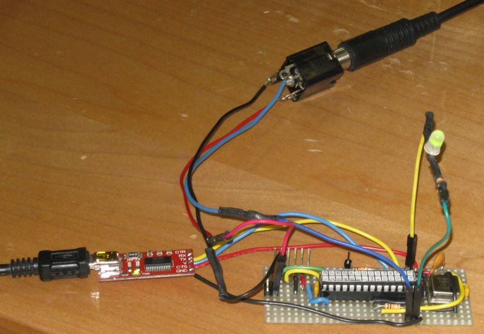
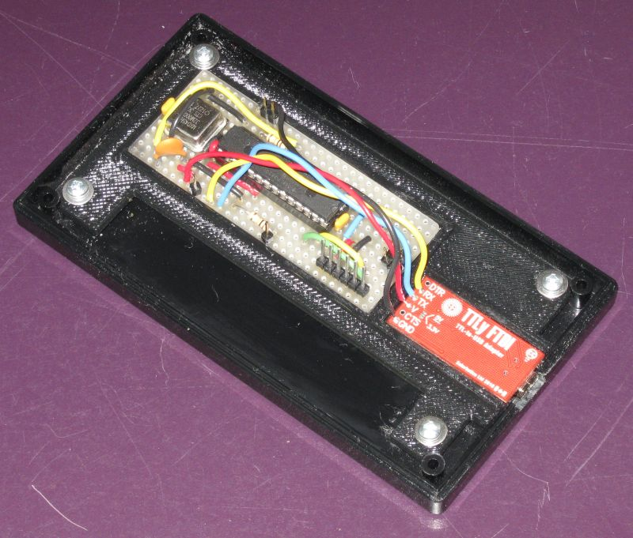

# Photogate Box
The photogate Box is an interface box intended to act as an interface between a photogate and a computer. 
The Photogate box includes a microcontroller with built-in hardware timers.

For more [information on what a photogate is *link*](https://answers.yahoo.com/question/index?qid=20080614212815AAqek64).

This branch is for the PIC18F2620 MCU (used in Richmond photogate boxes).

There is also a [branch for the PIC18F4525 MCU](https://github.com/danpeirce/photogate-box/tree/pic18f4525) (used in Surrey photogate boxes).



## Source code in C
The source code for this project is in C and is licensed under the [GNU GPL v3](http://www.gnu.org/licenses/gpl-3.0.txt).
See the file PhotogateLV.c

Modified in 2014 for XC8 compiler and to use an external clock.

### Added existing HEX file to project Files

Since this code has been working fine and was compiled years ago with an old compiler version and legacy peripheral 
libraries that we stooped using a number of years ago I have use a PICkit3 to read the memory of the existing unit and saved 
it as a hex file. If a new photogate timer box is to be constructed and programmed with this hex file.

* [hex/timer_box_PIC18F2620.hex](hex/timer_box_PIC18F2620.hex)

There is a six pin programming header on the PIC board in the lasergate box available for programming. In 2023 the MPlab IPE 
still works with a PICkit3.

## Communication between Timer Box and Host

In general the timer box firmware sits in the main while loop waiting for a command from the host. A command always starts with a question mark followed by a single numeric character. The rest of the command is command dependent. Onces times have been aquired by the timer box they are sent to the host as four byte binary values.

* See [host/README.md](host/README.md)

## Prototype project from 2006. 

> Some changes have been made that were not included in the notes at the link given below. Details
will be added to this README.md file to reflect the photogate timer box as is currently used.

* [Photogate Box Notes from 2006-2007](https://danpeirce.github.io/2006/timer_box/index.html)

## PIC Wiring



The PIC inputs and outputs as defined in the source code

```c
// Configure 2-Way Status LED

  TRISCbits.TRISC3 = 0;     // set as output 
  TRISCbits.TRISC4 = 0;     // and as output
```
  
```c
  // Configure USART module

  TRISCbits.TRISC6 = 0;     // set TX (RC6) as output 
  TRISCbits.TRISC7 = 1;     // and RX (RC7) as input
```

```c
  // Configure RC2/CCP1 and RB3/CCP2 as inputs
  // Photogate 1 is on RC2/CCP1/Pin 13 and 
  // Photogate 2 is on RB3/CCP2/Pin 24 
  TRISCbits.TRISC2 = 1;     // set RC2(CCP1) as input
  TRISBbits.TRISB3 = 1;     // set RB3(CCP2) as input 
```
  
...more details to come.

## Microchip Documents

* [Links to Microchip Documents and Install files](doc/MicrochipDocs.md)

## Enclosure

Photo of PCB's mounted on bracket plate which is mounted on the box lid. More detail about the mounting plate at <https://github.com/danpeirce/pic-box-bracket>



...more to come later...
